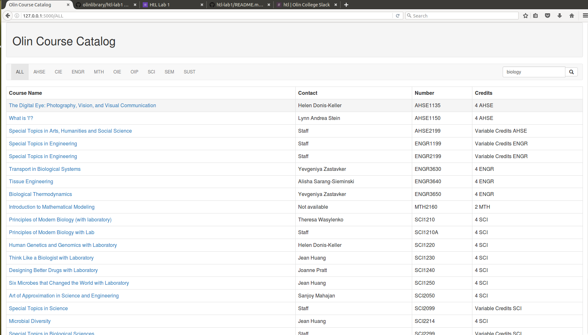

# HtL Lab 1, Sean Foley's edits

This is a [Flask](http://flask.pocoo.org) server that implements a minimal web-based interface to the Olin College
2016-2017 course catalog. The course data is scraped from the <olin.edu> web site. This is Sean Foley's improved version of the implementation at <https://github.com/olinlibrary/htl-lab1>, featuring Bootstrap formatting and a jerry-rigged search bar. Sources beyond the Hacking the Library faculty include Stackexchange, W3Schools, and the Pandas, Bootstrap, and Flask documentation.

## Screenshot



## Requirements

Python 3 is required to run this program.

## Setup

```
$ pip3 install flask
$ pip3 install pandas
```


## Usage

1. Run `$ python3 server.py`
2. Browse to <http://127.0.0.1:5000/>. (Running `server.py` also prints this URL.)


## Directory Structure

`server.py` is a web application, written using the Flask web framework.
See [here](http://flask.pocoo.org) for information on using Flask.
The application uses [pandas](http://pandas.pydata.org) to read the (CSV) data file,
and to filter the list of courses down to specific areas.

`templates/*.html` are the HTML templates that are served in response to HTTP requests to the server.
See the Flask documentation for more information about how this works.
These are Jinja templates; read [here](http://jinja.pocoo.org) for information about Jinja.

`data/` contains data files. This is currently limited to:

`data/olin-courses-16-17.csv` is [CSV](https://en.wikipedia.org/wiki/Comma-separated_values) file that lists the courses.
See the first line of the file itself for a description of its columns.

`scripts/scrape_course_catalog.py` scrapes the <olin.edu> web site to create the data file.
This script makes heavy use of [pandas](http://pandas.pydata.org).
You shouldn't need to run this – in fact, running it too often may look like an attack on the web site.
As with all web scraping, this script is fragile – a minor change to the olin.edu web design or URL format
could break it with no warning.


## Contributors

Written by Oliver Steele <oliver.steele@olin.edu> and Sean Foley.


## License

This code is made available under the MIT License
# htl-lab1
